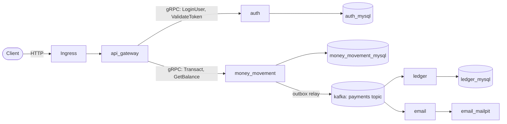

# node-payment-micro

A payments platform built as independent Node.js/TypeScript microservices, communicating over gRPC (synchronous calls) and Kafka (asynchronous events), deployed to Kubernetes.

## Architecture



`api_gateway` is the only service reachable from outside the cluster. `ledger` and `email` are independent consumers of the same `payments` topic, in separate consumer groups, so each sees every event regardless of the other.

## Services

| Service                                                | Description                                                                                                                              |
| ------------------------------------------------------ | ---------------------------------------------------------------------------------------------------------------------------------------- |
| `auth`                                                 | Authenticates users and issues/validates JWTs.                                                                                           |
| `money_movement`                                       | Executes account-to-account transfers and exposes balance lookups.                                                                       |
| `ledger`                                               | Kafka consumer that records a debit/credit audit-trail row for every transaction.                                                        |
| `email`                                                | Kafka consumer that sends payment-notification emails (via Mailpit locally, in place of a real SMTP provider).                           |
| `api_gateway`                                          | The HTTP/REST facade - exposes `/login`, `/balance`, and `/transact`, translating them into gRPC calls to `auth` and `money_movement`.   |
| `kafka`                                                | Self-hosted 2-node Kafka cluster (KRaft mode, no ZooKeeper) carrying the `payments` topic.                                               |
| `email_mailpit`                                        | [Mailpit](https://mailpit.axllent.org/) - a fake local SMTP server + web UI, used instead of a real mail provider for local development. |
| `auth_mysql` / `money_movement_mysql` / `ledger_mysql` | Dedicated MySQL instance per service - each service owns its own data, no shared database.                                               |

## Design highlights

A few things worth calling out about how correctness is handled under concurrency and partial failure, rather than assumed away:

- **Idempotency.** Every `/transact` call requires a client-generated `Idempotency-Key`. It's enforced with a `UNIQUE(from_user_id, idempotency_key)` constraint on the `transactions` table - the _insert itself_ is the atomic check-and-reserve, not a separate SELECT-then-INSERT (which would race). A retried request with the same key never re-processes; it just returns the original attempt's result, even under concurrent retries.
- **Transactional outbox.** `money_movement` never publishes to Kafka directly from the request path. It writes an event to its own `outbox` table in the _same database transaction_ as the balance update, so the two can never disagree - no world where money moves but no event fires, or an event fires for a transaction that got rolled back. A separate outbox-relay process polls that table and publishes to Kafka, marking rows published only after the send is confirmed - so a Kafka outage delays delivery but can never lose or duplicate-corrupt the underlying transaction record.
- **Deadlock-free balance locking.** A transfer locks both the sender's and recipient's balance rows in a fixed order (ascending by user ID, regardless of who's debited or credited), so two concurrent transfers between the same pair of users - in either direction - can't deadlock against each other.
- **No shared database.** Each service owns its own MySQL instance and schema; nothing reaches across a service boundary to query another service's tables directly.

## API flow & sample usage

1. **Login** to get a JWT:

   ```
   curl -X POST http://api.node-payment-micro.local/login \
     -H "Content-Type: application/json" \
     -d '{"user_id": "buyer@email.com", "password": "buyer123"}'
   ```

   Output: `{ "jwt": "<token>" }`

2. **Check balance**:

   ```
   curl http://api.node-payment-micro.local/balance \
     -H "Authorization: Bearer <jwt>"
   ```

   Output: `{ "balance": "500000" }`

3. **Transact**, using a client-generated idempotency key (retrying the same key never double-charges):

   ```
   curl -X POST http://api.node-payment-micro.local/transact \
     -H "Content-Type: application/json" \
     -H "Authorization: Bearer <jwt>" \
     -H "Idempotency-Key: <any-unique-string>" \
     -d '{"to_user_id": "georgio@email.com", "amount": 100}'
   ```

   Output: `{ "transaction_id": "<id>" }`

   This single call triggers the whole system: `money_movement` debits/credits the balances and writes an outbox event → the outbox relay publishes it to Kafka → `ledger` records the debit/credit pair → `email` sends a notification to both `buyer@email.com` and `georgio@email.com` (viewable in Mailpit).

Seeded accounts for local testing: `buyer@email.com` / `buyer123` (starting balance 500000) and `georgio@email.com` / `georgio123` (starting balance 0).

## Prerequisites

- Docker
- A local Kubernetes cluster - these instructions assume [minikube](https://minikube.sigs.k8s.io/) with its `ingress` addon enabled
- `kubectl`
- [`just`](https://github.com/casey/just) - used to run every deployment/inspection command below

## Building & pushing images

Each service builds and tags independently.

```
docker build -t dbharti001/auth-nodejs:1.0.0 auth/
docker push dbharti001/auth-nodejs:1.0.0

docker build -t dbharti001/money-movement-nodejs:1.0.0 money_movement/
docker push dbharti001/money-movement-nodejs:1.0.0

docker build -t dbharti001/ledger-nodejs:1.0.0 ledger/
docker push dbharti001/ledger-nodejs:1.0.0

docker build -t dbharti001/email-nodejs:1.0.0 email/
docker push dbharti001/email-nodejs:1.0.0

docker build -t dbharti001/payment-api-gateway-nodejs:1.0.0 api_gateway/
docker push dbharti001/payment-api-gateway-nodejs:1.0.0
```

(`email_mailpit` uses the public `axllent/mailpit` image directly - nothing to build.)

## Starting the services

```
minikube start
minikube addons enable ingress

just start-services
```

`start-services` deploys everything in a proper order:

> namespace
> Kafka
> Mailpit
> each service's database
> `auth` service (migrate db, then seed db, then deploy)
> `money_movement` service (migrate db, then seed db, then deploy) `ledger` service (migrate db, then deploy)
> `email` service
> `api_gateway`

Each step waits for the previous one to actually be ready before moving on.

Then, in a separate terminal (minikube's Ingress isn't reachable from the host without this):

```
minikube tunnel
```

And map the Ingress hostname - get the cluster IP with `minikube ip`, then add to `/etc/hosts`:

```
<minikube ip>  api.node-payment-micro.local
```

## Stopping the services

```
just stop-services
```

Stops everything in reverse dependency order.

## Accessing from the browser

### API Gateway

**Swagger UI** (the api_gateway's interactive API docs) - once the Ingress + tunnel + hosts entry above are set up:

```
http://api.node-payment-micro.local/docs/swagger
```

To skip the Ingress/tunnel setup entirely, port-forward the gateway directly instead:

```
kubectl port-forward -n node-payment-micro svc/api-gateway-service 1337:1337
```

then open `http://localhost:1337/docs/swagger`.

### Emails

**Mailpit** (see emails the `email` service has sent):

```
just mailpit-dashboard
```

then open `http://localhost:8025`.

## Local inspection

| Command                  | What it does                                                                           |
| ------------------------ | -------------------------------------------------------------------------------------- |
| `just db-auth`           | Opens a MySQL shell into `auth`'s database (users).                                    |
| `just db-money-movement` | Opens a MySQL shell into `money_movement`'s database (balances, transactions, outbox). |
| `just db-ledger`         | Opens a MySQL shell into `ledger`'s database (the debit/credit audit trail).           |
| `just mailpit-dashboard` | Port-forwards Mailpit's web UI to `http://localhost:8025`.                             |
| `just logs <service>`    | Tails a service's logs by its `app` label, e.g. `just logs ledger`.                    |

All three `db-*` recipes connect using each database's own least-privilege application user (not root) - no credentials are typed, hardcoded, or logged to your shell history.
